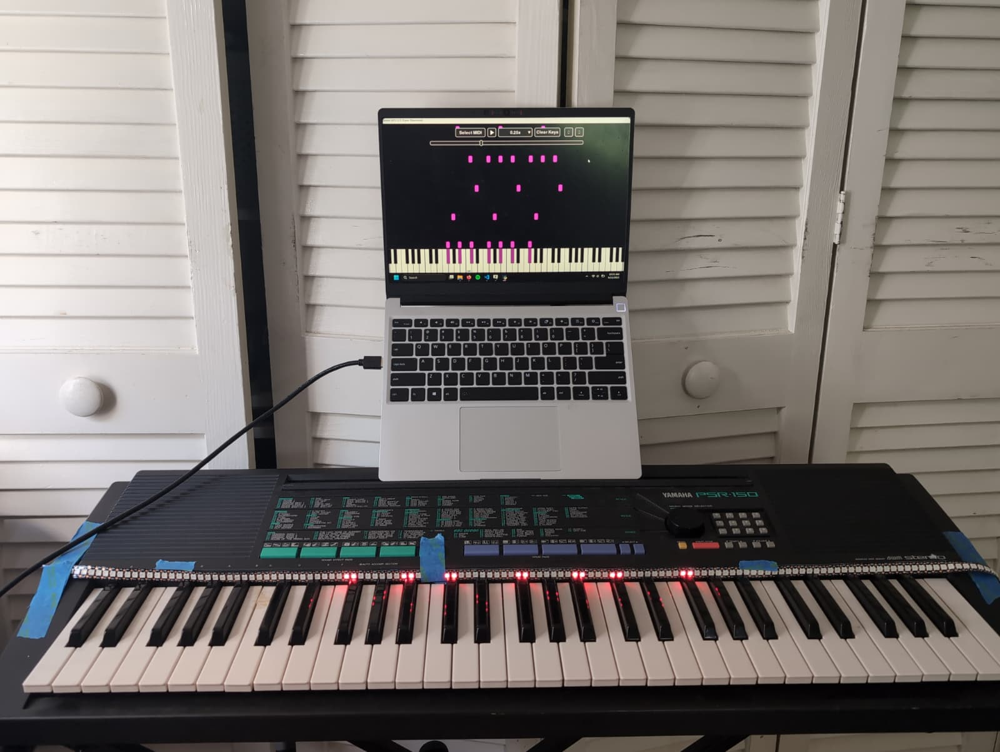
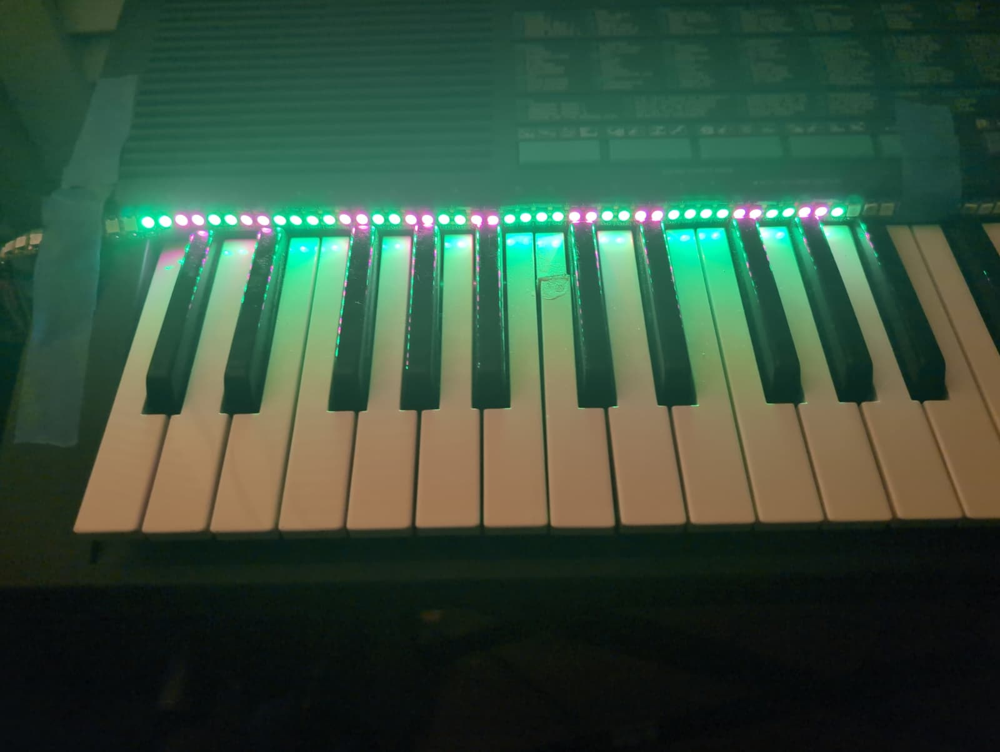

# MIDI LEDs-

## About

This is a Python application designed to help piano learners by providing a visual representation of key presses using an LED strip mounted on the keyboard. It aids with finger placement and sight reading of sheet music. Do keep in mind that this project is far from polished, cannot handle faster MIDI files, and has a number of errors. 
Additionally, the script is designed for Windows. A Linux or Mac could work, but the code doesn't currently accommodate it.

## Features

- **Real-time MIDI playback** with LED visualization
- **Configurable playback speed** (0.25x to 3.0x, plus custom speeds)
- **Falling note visualization** to help anticipate upcoming notes
- **Configuration mode** to customize LED-to-key mapping for different keyboards
- **Skip forward/backward** by chord/note set
- **Auto-fade** LEDs before note-on, turn off at note-on
- **Priority-based brightness** for multiple upcoming notes

## Setup 
- Flash an Arduino Nano with the sketch in the 'ArduinoNano' folder.
- Plug in an LED strip to the top of the nano for a serial -- I recommend buying a WS2811 strip with a three-pronged connector at the end. That way, you won't have to solder anything.
- Install dependencies: `pip install pygame mido python-rtmidi pyserial`
- Configure serial port in `DesktopApplication/Config.py` (default: COM9)
- Launch `DesktopApplication/MAIN.py`
- Select your MIDI file, play, and ideally, it'll just work from there.

## Configuration Mode

**NEW:** Use the Configuration Mode to customize how many LEDs (1, 2, or 3) each key uses, allowing the LED strip to align perfectly with your specific keyboard layout.

1. Click the "Configure" button in the GUI
2. All LEDs turn on to visualize the current mapping
3. Click on keys to cycle through LED counts: 1 → 2 → 3 → 1
   - Red overlay = 1 LED
   - No overlay = 2 LEDs (default)
   - Green overlay = 3 LEDs
4. Click "Configure" again to save your settings

Your configuration is saved to `led_config.json` and automatically sent to the Arduino.

## Documentation

For detailed documentation including architecture, protocol specification, and development guide, see [copilot.md](copilot.md).

---

## Gallery

  
  

---

## Roadmap

- [x] Add configuration mode for customizable LED mapping
- [ ] Improve LED responsiveness to handle more than 0.25x speed. 
- [ ] Make CAD files for 3D printable parts / Laser cut wood (so I won't have to tape the LEDs to my keyboard)
- [ ] Add MIDI Keyboard support
- [ ] Once optimized, make a 'learning' mode. 
